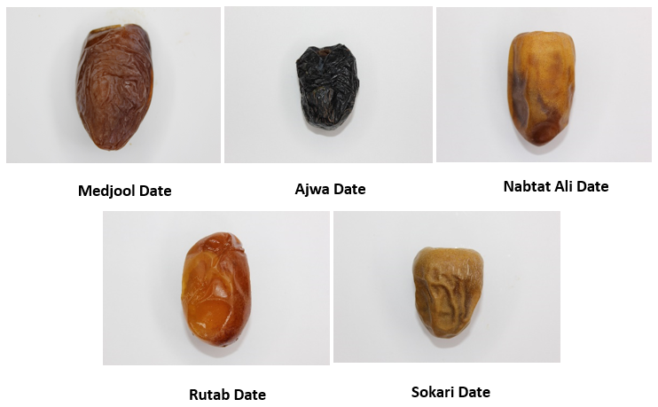
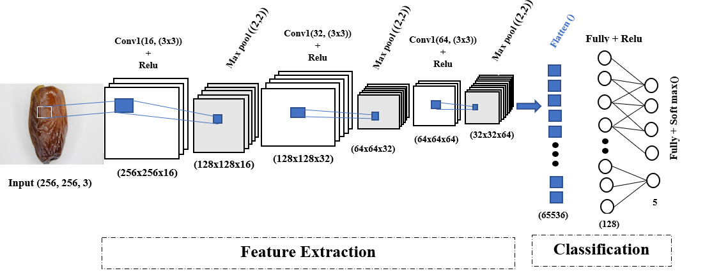

# Image Classification for the Most Recognized Date Varieties

🌴 Welcome to our Image Classification Project focusing on the most recognized date varieties in the Drâa-Tafilalet Region of Morocco! 🌴

In this project, we leverage Convolutional Neural Networks (CNN) for the classification of images representing different types of date varieties.

## Model Architecture
For this classification task, we have designed a powerful Sequential Architecture for our CNN model.

## Data Augmentation using DCGAN
Witness the magic of Data Augmentation through the lens of Deep Convolutional Generative Adversarial Networks (DCGAN).

For an in-depth exploration, delve into the notebook: [Data_Augmentation_Using_DCGAN.ipynb](Data_Augmentation_Using_DCGAN.ipynb).

## Training Insights
Discover the journey of our model through the captivating visualizations of loss functions during training and testing.

## Model Performance
Behold the accuracy of our model as it reaches new heights in recognizing date varieties.

## Confusion Matrix
Unveil the intricacies of classification with our Confusion Matrix.

## Dive In!
Explore the intricacies of our image classification journey in the accompanying notebooks. Your curiosity and feedback are highly valued!

🌴 Happy classifying the diverse world of date varieties! 🌴
